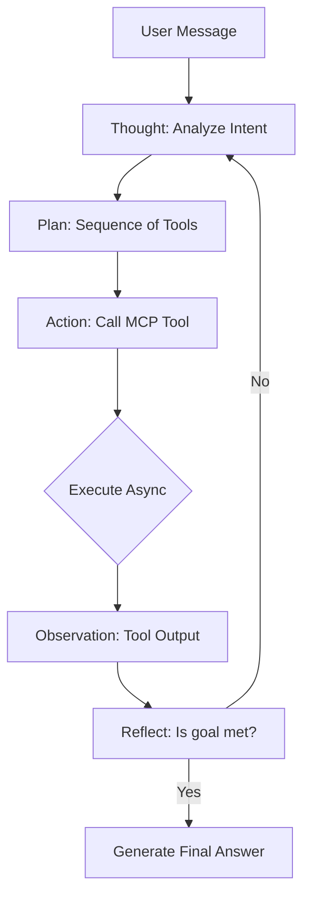

# ASURA Technical Architecture

**ASURA (Autonomous Sovereign Reasoning Agent)** is a high-autonomy, locally-governed AI ecosystem. This document serves as the master technical specification for the system's core engine, safety protocols, and evolutionary logic.

---

## 1. Core Philosophy: Agentic Sovereignty

ASURA is built on five non-negotiable technical pillars:

1.  **Local Sovereignty**: All reasoning, semantic memory (FAISS), and logic remain on hardware owned by the Master. No third-party cloud dependency for core intelligence.
2.  **Asynchronous Resilience**: A non-blocking architecture using `AsyncGateway` and **Parallel-Turbo** preparation to handle parallel inputs from TUI, Web, and Telegram with zero latency.
3.  **Tiered Intelligence**: Dynamic model routing using a "Draft-and-Verify" pattern (0.8B Fast Model for routing, **GPT-OSS 20B** Heavy Model for reasoning).
4.  **Structural Self-Awareness**: A live, incremental AST-scanned Knowledge Graph that allows the AI to understand its own codebase in near-real-time.
5.  **Persistent Sovereignty**: Automatic cross-platform wake-locking (**Sovereign Power Lock**) to ensure cluster nodes (Mac/Windows) remain responsive.

---

## 2. The Engine: Tiered ReAct Loop

ASURA operates via an iterative **ReAct (Reason + Act)** loop, implemented in `src/core/reasoning.py`.

### Two-Tier Model Routing
- **Fast Tier (0.8B)**: Handles intent classification, JSON schema extraction, and simple queries.
- **Heavy Tier (GPT-OSS 20B)**: Handles complex multi-step planning, coding, and architectural debugging.

### The Reasoning Protocol (ASURA-Zero)

1.  **Thought**: Analyze user intent and inventory available tools (via AST signatures).
2.  **Plan**: Construct a sequence of tool calls.
3.  **Act**: Execute tools via the MCP-Lite `tool_protocol.py`.
4.  **Observe**: Capture tool output (STDOUT, File data, etc.) with automatic context truncation to prevent window explosion.
5.  **Reflect**: Use the Heavy model to evaluate if the objective was met.

---

## 3. Sovereign Core: Module Reference

| Module | Purpose | File |
|:---|:---|:---|
| **anesthesia** | Unknown | `src/core/anesthesia.py` |
| **ast_surgeon** | Unknown | `src/core/ast_surgeon.py` |
| **auth** | Unknown | `src/core/auth.py` |
| **context_manager** | Context Window Management | `src/core/context_manager.py` |
| **curiosity** | Unknown | `src/core/curiosity.py` |
| **declarative_agent_loader** | Declarative Agent System | `src/core/declarative_agent_loader.py` |
| **doc_updater** | Autonomous Documentation Daemon | `src/core/doc_updater.py` |
| **federation** | Peer-to-Peer AI Synchronization | `src/core/federation.py` |
| **formatter** |  | `src/core/formatter.py` |
| **gateway** | Interactive Gateway | `src/core/gateway.py` |
| **habits** | AI Idle Habits | `src/core/habits.py` |
| **handoff** | Autonomous Agent Handoff Protocol | `src/core/handoff.py` |
| **hooks** | Pre/Post Tool Execution Hooks | `src/core/hooks.py` |
| **interceptors** | Security & Safety Interceptor System | `src/core/interceptors.py` |
| **job_manager** | Async Background Job Execution | `src/core/job_manager.py` |
| **knowledge_graph** | Unknown | `src/core/knowledge_graph.py` |
| **knowledge_scanner** | Unknown | `src/core/knowledge_scanner.py` |
| **llm** | Unknown | `src/core/llm.py` |
| **mcp** | Full Model Context Protocol (JSON-RPC 2.0) | `src/core/mcp.py` |
| **memory_manager** | Unknown | `src/core/memory_manager.py` |
| **model_manager** | Model Capability Registry & Router | `src/core/model_manager.py` |
| **observability** | Tool Execution Observability | `src/core/observability.py` |
| **observer** | Proactive File System Observer | `src/core/observer.py` |
| **permissions** | Granular Permissions Framework | `src/core/permissions.py` |
| **phantom_verify** | Ghost Sandbox Verification | `src/core/phantom_verify.py` |
| **proactive** | Proactive Messaging & Idle Behavior | `src/core/proactive.py` |
| **rbac** | Role-Based Access Control | `src/core/rbac.py` |
| **reasoning** | Chain-of-Thought Reasoning Engine | `src/core/reasoning.py` |
| **recommendation** | Unified Recommendation & Task Store | `src/core/recommendation.py` |
| **resource_governor** | Resource Governor | `src/core/resource_governor.py` |
| **rule_engine** | Declarative Behavior Rule Engine | `src/core/rule_engine.py` |
| **self_healing** | Autonomous Self-Healing Daemon | `src/core/self_healing.py` |
| **self_recovery** | Deep Recursive Self-Repair | `src/core/self_recovery.py` |
| **self_updater** | LLM-Driven Self-Evolution Engine | `src/core/self_updater.py` |
| **sovereignty** | Cross-Platform Anti-Sleep Protocol | `src/core/sovereignty.py` |
| **startup_checks** | Boot-time tool verification | `src/core/startup_checks.py` |
| **state_manager** | Unknown | `src/core/state_manager.py` |
| **sub_agent_memory** | Unknown | `src/core/sub_agent_memory.py` |
| **surgeon** | Unknown | `src/core/surgeon.py` |
| **task_queue** | Priority Task Queue | `src/core/task_queue.py` |
| **tool_protocol** | MCP-Lite: Dynamic Tool Protocol | `src/core/tool_protocol.py` |
| **vcs** | Unknown | `src/core/vcs.py` |
| **workflow_engine** | YAML-Driven Workflow Automation | `src/core/workflow_engine.py` |
---

## 4. Multi-Layer Sovereign Memory

ASURA solves "Context Starvation" via a tiered storage architecture:

*   **Level 1 (Short-Term)**: Rolling 50-turn context window managed in `context_manager.py`.
*   **Level 2 (Intermediate)**: Semantic RAG. Uses `nomic-embed-text` to index episode summaries into a FAISS vector store.
*   **Level 3 (Relational)**: Architectural Knowledge Graph. Maps code dependencies via AST.
*   **Level 4 (Sovereign Vault)**: Immutable facts and high-priority user preferences injected into every prompt.
*   **Agent Vaults**: Isolated JSON scratchpads for declarative sub-agents to prevent context pollution.

---

## 5. Safety & Process Isolation

### The 5-Layer Validation Sandbox
ASURA never writes to `src/` without passing:
1.  **Syntax Validation**: `ast.parse` ensures code is valid Python.
2.  **Import Tracing**: Subprocess dry-runs ensure all dependencies are met (auto-installs if needed).
3.  **Phantom Isolation**: Mutations are applied to temporary Git branches.
4.  **Ghost Repair**: If a core file is corrupted, the system restores it from a **Golden Snapshot**.
5.  **Surgical VCS**: Every change is logged as an invertible patch.

### Resource Throttling
- **Warning (>75%)**: Throttles non-essential background daemons (Curiosity, Documentation).
- **Critical (>90%)**: Enters Safe Mode, suspends all outbound mutations, and triggers self-healing.

---

## 6. The "Witness" Advanced Self-Healing

Implemented in `src/core/self_healing.py`, this architecture moves beyond reactive fixing to a biologically-inspired immune response.

1.  **Sentinel (Sensing)**: Case-insensitive, pattern-agnostic log monitoring for "anomaly scent."
2.  **Architect-Critic (Brain)**: GPT-20B plans the fix; Qwen-0.8B reviews for security and bloat.
3.  **Surgeon (Precision)**: Multi-point patching that addresses root causes in dependency trees.
4.  **Sandbox (Isolation)**: **Ghost Sandbox** verifies fixes in isolated clones before deployment.
5.  **Witness (Cluster)**: PC-1 requests validation from RNDPC before final commitment.

---

## 7. Production Directory Structure

```
ASURA/
├── src/
│   ├── core/           # The Sovereign Engine (Logic, Reasoning, Memory)
│   │   └── utils/      # Shared utilities (JSON, retry, time)
│   ├── skills/         # Capabilities: 50+ modular tools
│   ├── cli/            # Interface: TUI and CLI entry points
│   ├── agents/         # Personas: Markdown-defined specialists
│   └── daemon/         # Background: Persistent servers (Voice, Gateway)
├── tests/              # Verification: Benchmarks, audits, and unit tests
├── data/
│   ├── memory_store/   # FAISS Vector Index
│   ├── recovery_cache/ # Persistent Golden Snapshots
│   └── logs/           # Unified audit and application traces
└── docs/               # Sovereignty: Master Documentation
```

---
*Last Updated: 2026-03-19 (Phase S.2 - Witness Architecture Edition)*
