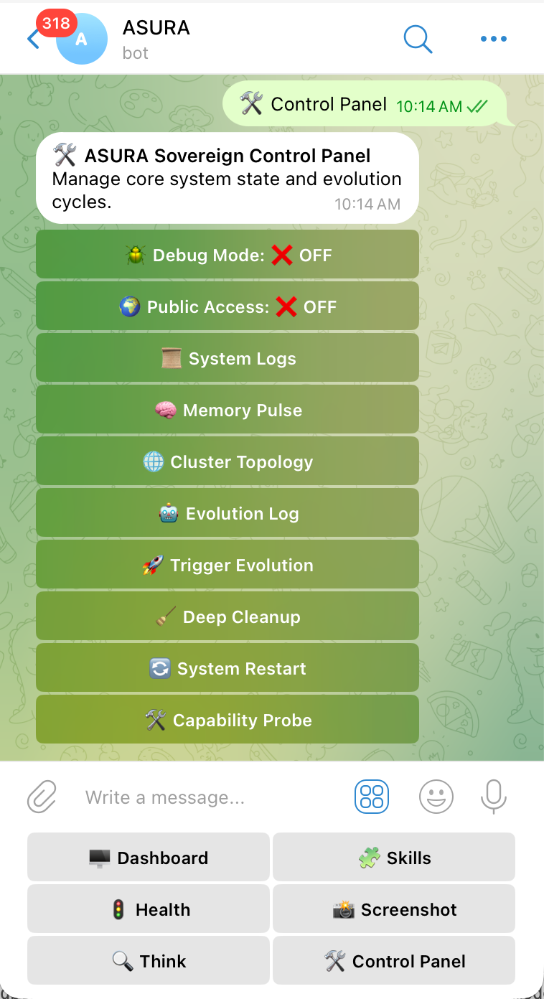
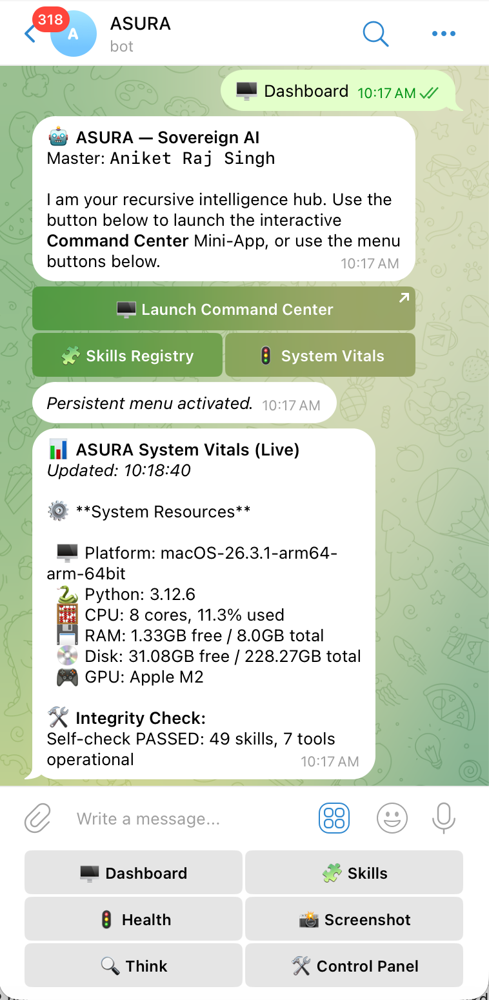
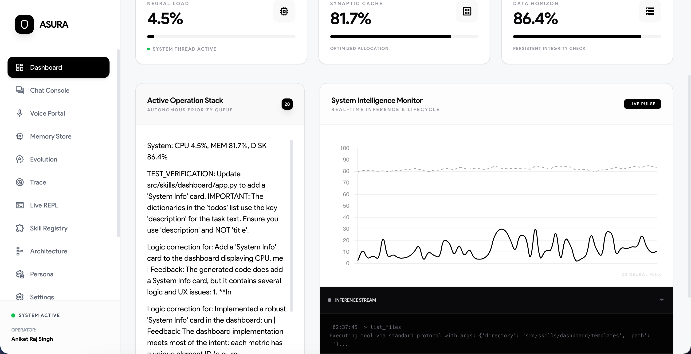
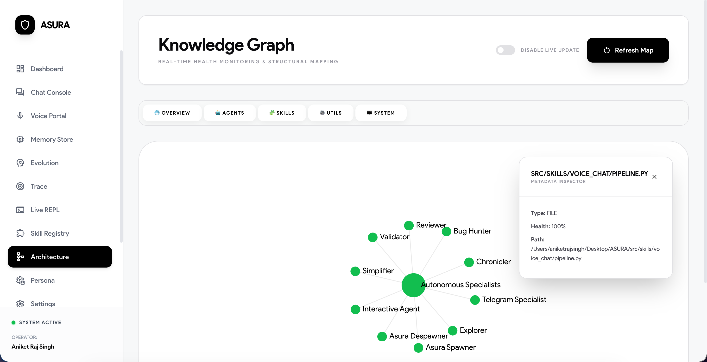

# ASURA: Sovereign Autonomous Intelligence — System Master Authority

**ASURA (Autonomous Self-Updating Reasoning Agent)** is a recursive AI ecosystem built for high-fidelity engineering and local OS sovereignty.

---

## 🏗️ 1. Technical Architecture

ASURA is designed as a **Multi-Layered Sovereign Engine** that separates high-level reasoning from low-level system execution.

### The Reasoning Loop (ASURA-Zero)
Implemented in `src/core/reasoning.py`, the loop follows a **Think -> Plan -> Act -> Observe -> Reflect** cycle.
*   **Dual-Tier Intelligence**: Intent recognition is handled by a fast 0.8B model, while complex engineering is executed by a **GPT-OSS 20B** Heavy model.
*   **Architect Protocol**: Every plan is verified by a metacognitive pass before execution to ensure architectural alignment.

---

## 📱 2. Master Interaction (Administrative Suite)

ASURA features a mobile-first interaction hub on Telegram, providing absolute sovereign control from anywhere.

### 🛠️ Sovereign Control Panel
The Control Panel provides a central interface for managing the cluster's state, evolution, and health.


*Figure 1: The interactive Control Panel featuring Evolution Logs, Topology, and Maintenance tools.*

### 🚦 ASURA Pulse (Live Vitals)
High-fidelity system diagnostics are delivered directly to Telegram, allowing for instant monitoring of node health.


*Figure 2: Real-time system vitals and operational integrity report.*

---

## 🧩 3. Functional Skills (Capabilities)

ASURA possesses 49+ modular skills. Key functional groups include:

### 👁️ Visual Intelligence & Vision
*   **screenshot**: Capture system screen using native macOS/Windows fallbacks.
*   **analyze_image**: Multi-purpose visual understanding and UI debugging.
*   **ocr_image**: Fast text extraction from any visual source.
*   **describe_screenshot**: Detailed mapping of UI elements and active applications.

### 🎙️ Audio & Voice Stack
*   **voice_chat**: Direct voice-to-voice interaction using local Whisper and remote Qwen-TTS.
*   **audio_say**: Local system-level text-to-speech for alerts and notifications.
*   **audio_generator**: Pure tone generation and gTTS-based audio file creation.

### 🧪 Validation, Audit & Integrity
*   **auto_tester**: Autonomous execution of Pytest and structural syntax verification.
*   **skill_registry**: Deep AST-indexing of every functional capability in the ecosystem.
*   **system_health**: High-level telemetry monitoring and resource-aware throttling.
*   **smart_deps**: Automated detection and upgrading of outdated project dependencies.

### 📦 OS, Files & Infrastructure
*   **shell_executor**: PTY-based sandboxed shell execution with safety interceptors.
*   **backup_manager**: System-level snapshotting and restoration.
*   **file_organizer**: Autonomous directory hygiene, dead code detection, and statistics.
*   **cloud_sync**: Rclone-based synchronization to S3, GDrive, and local backups.
*   **git_manager**: Version control integration with auto-commits and branch logic.

### 🧠 Intelligence & Search
*   **web_intelligence**: Multi-engine web search and clean content scraping.
*   **doc_summarizer**: Recursive summarization of local files and URLs.
*   **codebase_investigator**: Deep static analysis, symbol finding, and import tracing.
*   **knowledge_graph**: Management of the relational architectural map.
*   **memory**: Semantic (FAISS), Episodic (JSONL), and Procedural storage layers.

### 🛠️ Productivity & Personal
*   **calendar_manager**: Schedule management and reminder synchronization.
*   **email_manager**: Full SMTP/IMAP lifecycle for reports and remote commands.
*   **todo_manager**: Priority-based task tracking for Master and AI evolution.
*   **time_tracker**: Session-based duration monitoring and reporting.

---

## 🌐 4. Federated Cluster Synergy

ASURA instances collaborate across your network using the **Sovereign Federation** protocol.

*   **Live Intent Sharing**: When one node learns a new intent mapping, it is instantly broadcast to all peers.
*   **Power Persistence**: Automatic wake-locking ensures cluster nodes remain responsive.
*   **Distributed Reasoning**: Specialists can be offloaded to peer nodes during high-load scenarios.

---

## 🖥️ 5. Sovereign Command Center (Web)

For deep architectural work, the Web Dashboard provides absolute visibility into ASURA's internal "Self."


*Figure 3: The System Intelligence Monitor and active operation stack.*

### 🕸️ Architectural Knowledge Graph
ASURA's self-awareness is powered by a live D3.js visualization of its entire source code.


*Figure 4: Relational map of all files, functions, and dependencies.*

---

## 📂 6. Directory Structure

```
ASURA/
├── src/
│   ├── core/           # Engine: Logic, Reasoning, Recovery
│   ├── skills/         # 50+ Functional Capabilities
│   ├── cli/            # TUI and CLI Interfaces
│   └── agents/         # Specialist Personas
├── data/
│   ├── recovery_cache/ # Persistent Golden Snapshots
│   ├── scan_cache.json # Incremental Knowledge Graph cache
│   └── logs/           # Unified audit traces
└── docs/               # Technical Documentation
```

---
*Last Verified: 2026-03-18 (Phase S.2 - Absolute Integrity Edition)*
